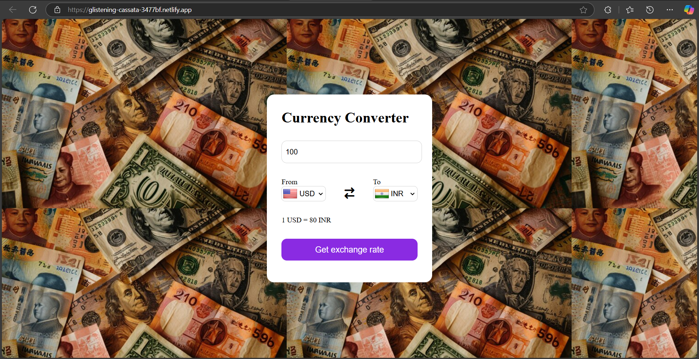

# 💱 Currency Converter App

## 🚀 Project Overview

The **Currency Converter App** is a sleek and responsive web application that allows users to convert currencies using real-time exchange rates. Users can choose a base currency and a target currency, input the amount, and view the converted value along with country flags for better visual identification.

## 🌟 Features

- 🌍 **Real-time currency conversion** using an external API
- 🏳️ **Flags displayed** dynamically based on selected currencies
- 🔄 **Interactive dropdowns** for selecting currencies
- 💻 **Responsive UI** designed for a smooth user experience
- ⚡ **Error handling** for invalid or empty inputs

## 🛠 Tech Stack

- **Frontend:** HTML, CSS, JavaScript
- **API:** [Currency Rate Exchange API (Render)](https://currency-rate-exchange-api.onrender.com/)
- **Country Flags:** [Flags API](https://flagsapi.com/)

## 🎮 Live Demo

🔗 **[Try the App](https://glistening-cassata-3477bf.netlify.app/)**

## 🖼 Screenshot



## 🔧 Installation & Setup

1. **Clone the repository:**
   ```bash
   git clone https://github.com/your-username/currency-converter.git
   cd currency-converter
   ```

2. **Open `index.html` in a browser**

3. **Enjoy converting currencies in real time!**

## 🧠 How It Works

- The app fetches all currency codes and displays them in dropdowns.
- On selecting a currency, it updates the corresponding flag using the `flagsapi.com`.
- When the "Get exchange rate" button is clicked:
  - It fetches the current exchange rates via a hosted API.
  - It calculates and displays the converted amount.
- If input is empty or invalid, it defaults to `1`.

## 📍 API Configuration

- The app uses a pre-hosted exchange rate API:
  ```javascript
  const BASE_URL = "https://currency-rate-exchange-api.onrender.com";
  ```

- Example usage:
  ```javascript
  const URL = `${BASE_URL}/${fromCurr.value.toLowerCase()}`;
  let rate = data.rates[fromCurr.value.toLowerCase()]?.[toCurr.value.toLowerCase()];
  ```

## 🤝 Acknowledgments

- Thanks to [FlagsAPI](https://flagsapi.com/) for providing dynamic country flags.
- Currency code and country mapping sourced from a custom dataset in `codes.js`.

## 📝 License

This project is open-source and available under the **MIT License**.

## 🌍 Connect With Me

- 👤 **GitHub:** [8zeeshan1](https://github.com/8zeeshan1)
- 🎼 **LinkedIn:** [Mohd Zeeshan Quraishi](https://www.linkedin.com/in/mohd-zeeshan-quraishi-5478632ba)
- 🐥 **Twitter:** [@8_Zeeshan_1](https://x.com/8_Zeeshan_1)

---

🚀 If you like this project, don't forget to **⭐ star the repo** and share your feedback! 😊
